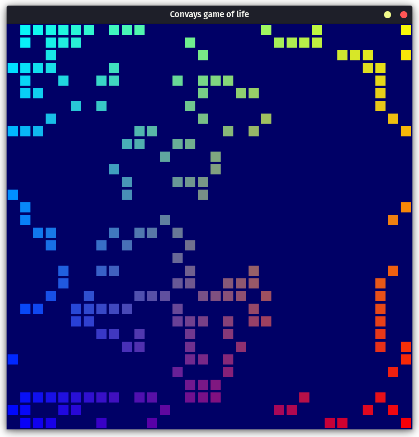

# game-of-life-wgpu

implementation of convays game of life using
Rust and WebGPU (compute shaders)

## References
[Google Codelab game of life js implmentation](https://codelabs.developers.google.com/your-first-webgpu-app#0)

## Progress
- [x] minimal working project
- [ ] change gridsize based on window size
- [ ] compile to wasm (optional)
- [ ] try using texture2d (optional)

